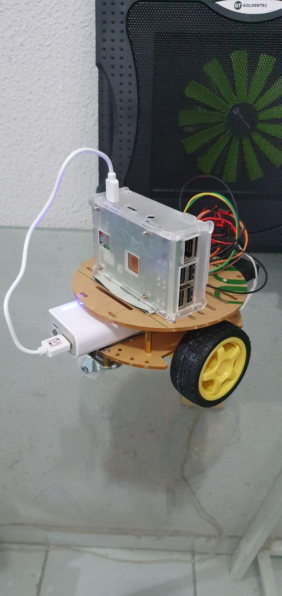
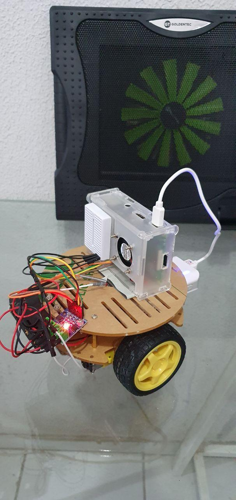
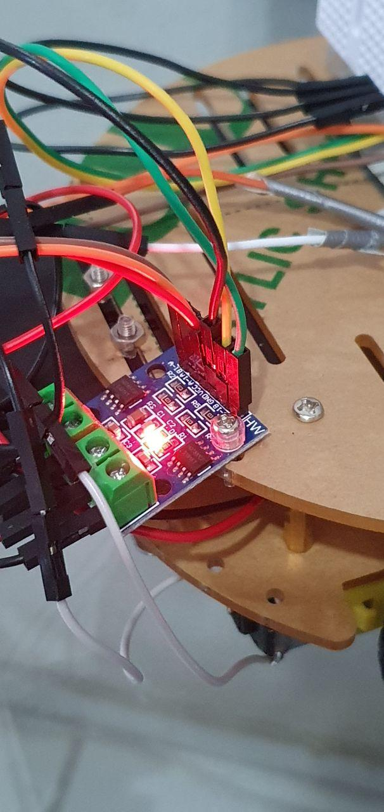
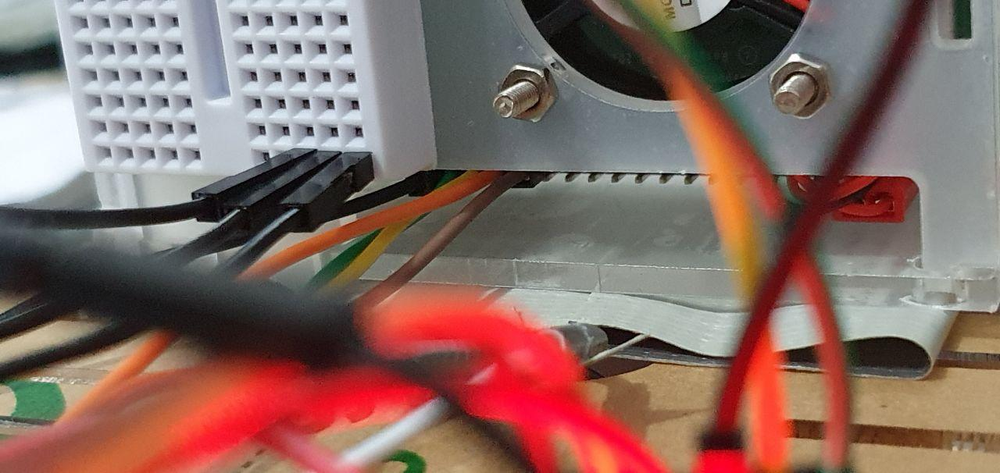
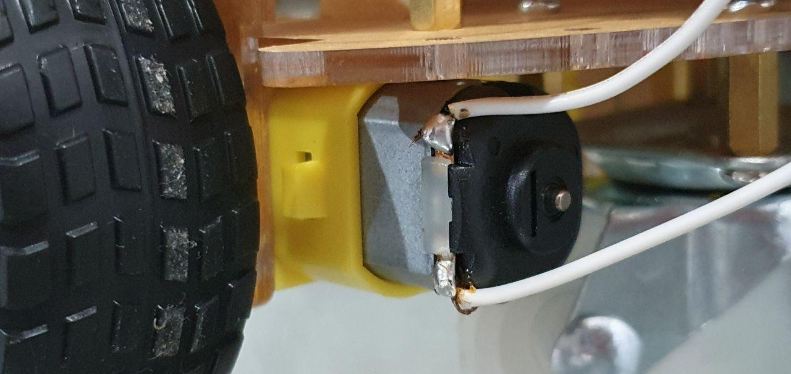

# moving car

Small node script to move a 2-wheeled car using raspberry pi.

## hardware

- [1 acrylic chassi 2 wheel car kit](https://www.smartkits.com.br/chassi-robotico-2-rodas-redondo-2wd)
- [1 hg7881 module h-bridge](https://www.smartkits.com.br/driver-ponte-h-hg7881)
- [1 raspberry pi 3 model b+](https://www.raspberrypi.org/products/raspberry-pi-3-model-b-plus/)
- [4 duracell batteries](https://www.duracell.com.br/products/pilhas-alcalinas/?segment=basic#our-products)
- [1 power bank or power supply for raspberry](https://www.mimofast.com.br/pilhas-e-baterias/power-bank/power-bank-carregador-mos-2-6000-mah-hmaston)

## schematics

coming soon

## testing from command line

```bash
gpioset -m time -u 500000 0 19=0
gpioset -m time -u 500000 0 26=0
gpioset -m time -u 500000 0 13=0
gpioset -m time -u 500000 0 6=0
```

## running

just checkout this project inside your raspberry

```bash
npm install
npm start
```

now open a browser pointing to port 3000 on this rasp. an web interface will
offer some controls.

## photos






