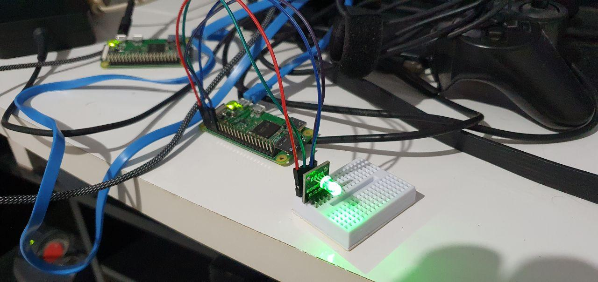

# rgb led

Sampling blink led, tested on raspberry pi zero w with debian this time. There
is no fedora for this tiny arm board, but libgpiod v1.2 and nodejs 10 are
available!

## hardware

- [1 RGB LED module](https://produto.mercadolivre.com.br/MLB-1494333072-modulo-ky-016-led-rgb-5mm-para-arduino-esp8266-esp32-_JM)
- [1 raspberry pi zero w](https://www.raspberrypi.org/products/raspberry-pi-zero-w/)

## software

- [official Raspberry Pi OS](https://www.raspberrypi.org/software/operating-systems/#raspberry-pi-os-32-bit)
- libgpiod installed + dev packages
- nodejs + dev packages

```bash
sudo apt install nodejs libnode-dev npm gpiod libgpiod-dev libgpiod2
```

## schematics

coming soon

## testing from command line

```bash
gpioset -m time -s 3 0 21=1
gpioset -m time -s 3 0 20=1
gpioset -m time -s 3 0 16=1
```

## running

just checkout this project inside your raspberry

```bash
npm install
npm start
```

now open a browser pointing to port 3000 on the rasp. A web interface will
offer some controls.

## photos


